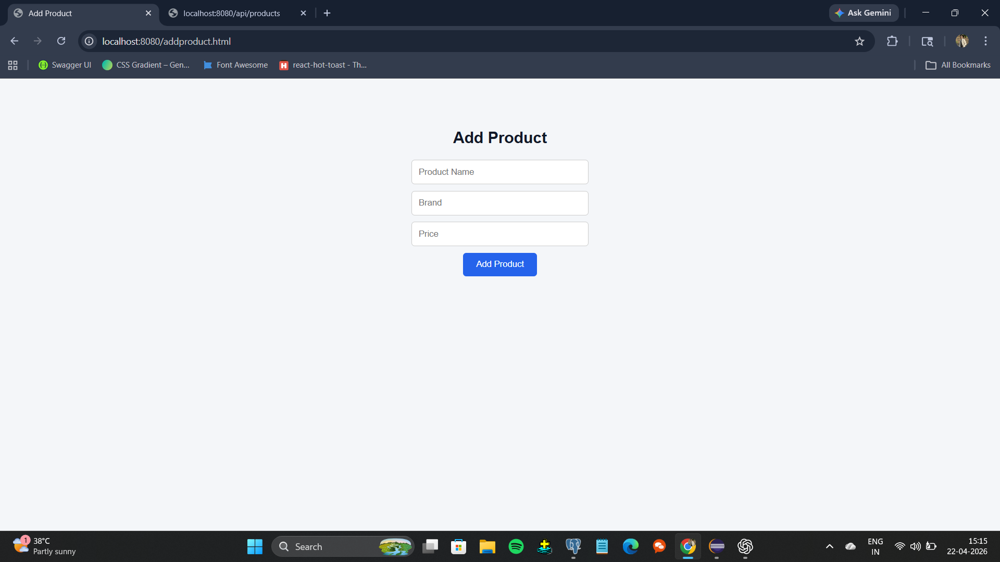
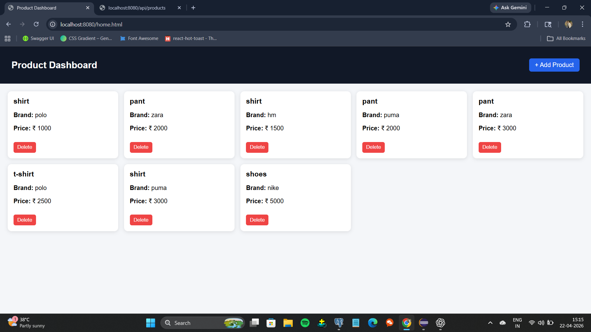

📚 Product Management System

A simple Product Management System built using Spring Boot and HTML, CSS, JavaScript to manage books with basic CRUD operations.

🚀 Features
Add, update, delete products,View all products

REST API integration

🛠️ Tech Stack
Frontend: HTML, CSS, JavaScript

Backend: Spring Boot (Java)

Database: Postgres SQL

HOME PAGE :

ADD BOOK PAGE :

⚙️ Run Locally 

git clone https://github.com/your-username/Product-management-system.git

cd Product-management-system

mvn spring-boot:run

Open index.html in browser.

🔌 API

GET /api/products

POST /api/products

PUT /api/products/{id}

DELETE /api/products/{id}
